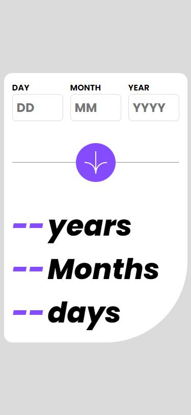
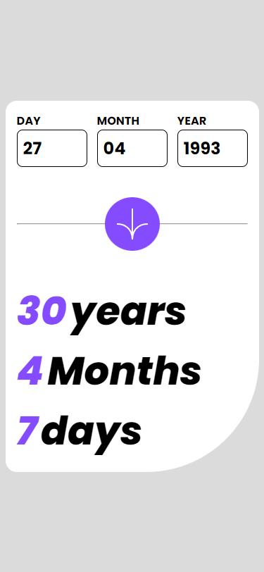
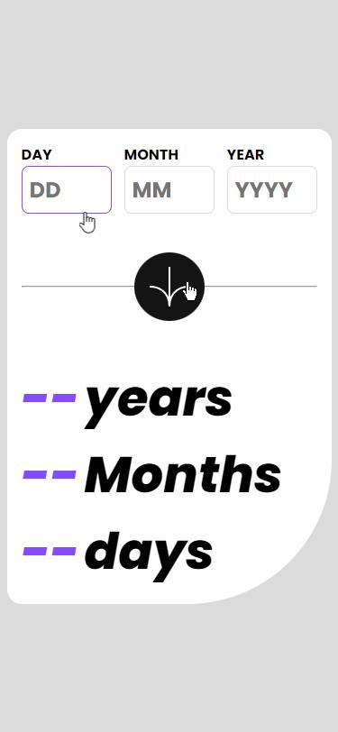
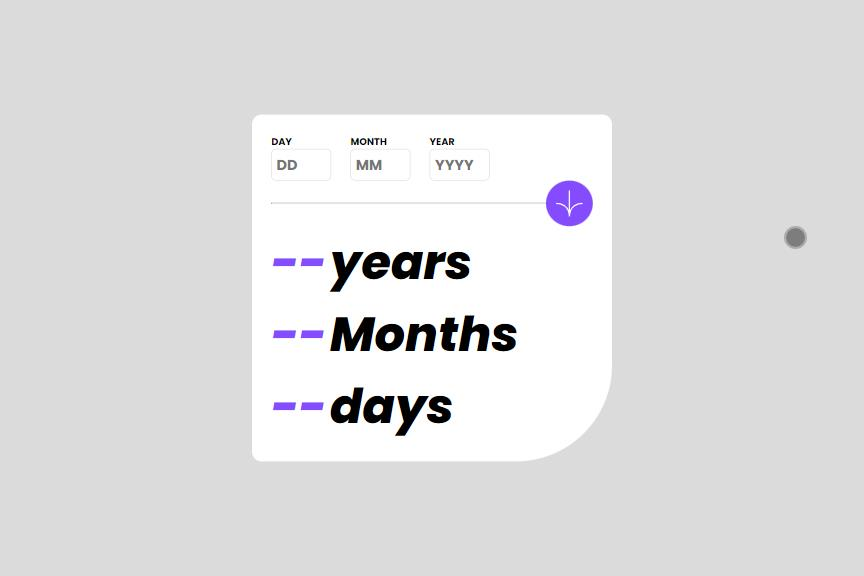
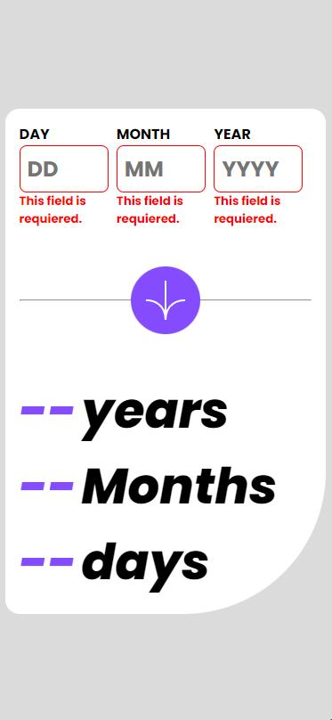
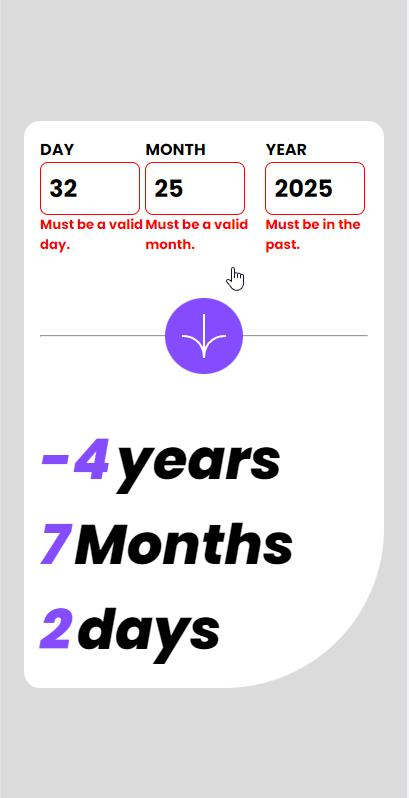

# Frontend Mentor - Age calculator app solution

Hi everybody! 👋
This is a solution to the [Age calculator app challenge on Frontend Mentor](https://www.frontendmentor.io/challenges/age-calculator-app-dF9DFFpj-Q).

## Table of contents  🧾

- [Overview](#overview)
  - [The challenge](#the-challenge)
  - [Screenshot](#screenshot)
  - [Links](#links)
- [My process](#my-process)
  - [Built with](#built-with)
  - [What I learned](#what-i-learned)
  - [Continued development](#continued-development)
  - [Useful resources](#useful-resources)
- [Author](#author)
- [Acknowledgments](#acknowledgments)

## Overview

### The challenge  🎯

Users should be able to:

- View an age in years, months, and days after submitting a valid date through the form
- Receive validation errors if:
  - Any field is empty when the form is submitted
  - The day number is not between 1-31
  - The month number is not between 1-12
  - The year is in the future
  - The date is invalid e.g. 31/04/1991 (there are 30 days in April)
- View the optimal layout for the interface depending on their device's screen size
- See hover and focus states for all interactive elements on the page
- **Bonus**: See the age numbers animate to their final number when the form is submitted

### Screenshot 📷

### Links 🔗

- Repository: [Github](https://github.com/Arfirpo/age-calculator-app-main)
- Live Site URL: [Solution - Github Page](https://arfirpo.github.io/age-calculator-app-main/)

## My process ⚙️

### Built with 🛠️

- Semantic HTML5 markup
- CSS custom properties
- Flexbox
- Javascript

### What I learned 📚

XXXXXXXXXXXXXXXXXXXXXXXXXXXXXX

### Continued development 🔨

XXXXXXXXXXXXXXXXXXXXXXXXXXXXXXXXXXX

## Author 🙋🏻‍♂️

- Twitter/X - [@agus_firpo](https://twitter.com/agus_firpo)
- Frontend Mentor - [@Arfirpo](https://www.frontendmentor.io/profile/Arfirpo)
- Linkedin - [Agustín Rodrigo Firpo](https://www.linkedin.com/in/agustin-rodrigo-firpo-0aa86697/)
